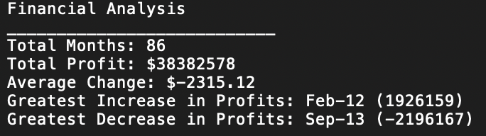

#PyBank

## Objective

* Perfrom financial analysis on the given budget data <b>(budget_data.csv)</b>

* The task is to create a Python script that analyzes the records to calculate each of the following and writes the analysis to a text file:

		The total number of months included in the dataset
		
		The net total amount of "Profit/Losses" over the entire period
		
		The average of the changes in "Profit/Losses" over the entire period
		
		The greatest increase in profits (date and amount) over the entire period
		
		The greatest decrease in losses (date and amount) over the entire period 
		
##Technologies 

Code is written in Python 3. I used a jupyter notebook to perform the anlaysis. App can be performed in the terminal with Python 3 installed. 

##Results 
The resulted analysis is printed into a text file which will appear in your cloned repo. 
The analysis resulted in the following table: 
 